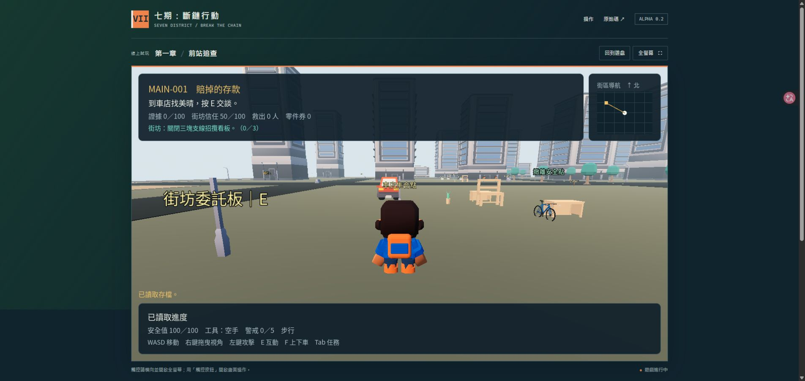

# 七期：斷鏈行動 / Seven District: Break the Chain

**Alpha 0.2.0：網頁單人遊玩、六個支線與四個活動。** 原創第三人稱沙盒動作遊戲，以台中七期的高級商辦與街廓為靈感，使用 Blender 製作資產、Godot 執行遊戲。

[直接線上遊玩](https://seven-district-reckoning.digimkt.workers.dev) · [網頁操作與存檔說明](docs/web-play.md) · [Windows Alpha 0.1.0](https://github.com/mars-tw/seven-district-reckoning/releases/tag/v0.1.0)

線上版已發布。瀏覽器版本免安裝，首次開啟需要下載遊戲資料；這是單人遊戲。

玩家扮演被虛擬貨幣假投資平台騙走積蓄的外送員。從確認失聯訊息、拆掉假客服門面，到騎自行車帶回線索、救出受困者，最後選擇打砸、蒐證或救援的處理重心。企業、人物、設施和可玩地圖均為虛構；作品使用原創與可再散布的素材。

A stylized, original third-person action sandbox made with **Godot 4.7.2** and **Blender 5.2.0 LTS**. Alpha 0.2 adds browser play, six side quests, four activities, touch controls and ambient district life within the existing 300 × 300 m alpha map. Play the published browser build at the link above.

上圖為公開網址的 Alpha 0.2.0 實際瀏覽器畫面，已讀回角色位置與支線進度。人物、企業與地圖皆為虛構。[歷史桌面版畫面](docs/evidence/alpha-gameplay-1366x600.png)

## 下載與啟動

網頁版從[發布位置](https://seven-district-reckoning.digimkt.workers.dev)開啟。先按「開始線上遊玩」，等下載與啟動完成後再按「進入街區」。已有進度可使用「讀取存檔」。建議使用支援 WebGL 2、開啟硬體加速的電腦瀏覽器；觸控裝置請用橫向與全螢幕，手機操作及效能仍在測試中。[完整說明](docs/web-play.md)

Windows 下載目前保留已發行的歷史版本：

[Windows Alpha 0.1.0](https://github.com/mars-tw/seven-district-reckoning/releases/tag/v0.1.0)

下載 Windows ZIP、解壓縮後執行 **SevenDistrict.exe**，即可進入遊戲。執行檔已包含遊戲資料，玩家不必另外安裝 Blender 或 Godot。這是尚未簽章的開發版本。

從原始碼執行：以 Godot 4.7.2 開啟 `godot/project.godot`，等待資產匯入後按 F5。[建置與測試步驟](docs/build-from-source.md)

## 已實作內容

- 五個第一章主線：賠掉的存款、假客服的門面、兩個輪子的捷徑、玻璃後面的人、前站斷電。
- 六個支線：招牌不會自己倒、沒寄出去的信、沒拿回來的背包、美晴的零件單、巷子裡的送達、把早餐店開回來。
- 四個活動：自行車路標賽、停車場繞標、街景留影、社區急送。活動可重玩，首次完成領獎，計時活動保留個人最佳；街景相簿保留已收集的地點。
- 既有 **300 × 300 m** 地圖內增設六個周邊街區：舊街車店、商辦核心、公園步道、停車廣場、前站廣場、轉運街區。
- 八位背景行人、四台沿路線行駛的車與六台停放的車；新增街區沿用既有模型。
- 步行、衝刺、跳躍、第三人稱鏡頭及鏡頭牆面碰撞。
- 球棒、扳手與虛構脈衝器具；攻擊有骨骼動畫與命中時間窗。
- 守衛巡邏、追擊、受擊及倒地；受困者跟隨玩家到安全點。
- 一款汽車、一款自行車；加速、煞車、真實輪組動畫、安全下車與取回。
- 招牌、玻璃隔屏、辦公桌、展示設備、機櫃外殼與路障的損壞及存檔狀態。
- 第一章最後可選破壞、蒐證或救援；顯示章節成果，完整戰役結局留給後續 MVP。
- 繁中 HUD、任務手機、小地圖、主選單、暫停與章節畫面。
- 網頁單人版、下載進度與失敗重試、全螢幕、網頁操作列，以及遊戲內的觸控移動與動作按鈕。
- 原子存檔、上一份備份、任務檢查點、道具與能量、守衛及載具狀態還原。
- 支線成果、活動紀錄、相簿與零件券會存檔。瀏覽器進度限定同一個瀏覽器與網站網址，清除網站資料會遺失；不與 Windows 版同步。
- **25 個實際 GLB、25 份 Blender 源檔**、使用到的原始模型、素材授權與重建工具。

## 操作

網頁版以**按住滑鼠右鍵拖曳**轉動視角；原生桌面版保留滑鼠捕捉視角。網頁操作列可開啟任務與委託、暫停、繼續及存讀檔。手機使用畫面內的移動與動作按鈕，並可點「視角←／視角→」；操作區過小時請依提示放大或切換全螢幕。

| 操作 | 按鍵 |
| --- | --- |
| 移動／衝刺 | WASD／Shift |
| 看向／攻擊 | 桌面版：滑鼠／左鍵；網頁版：右鍵拖曳／左鍵 |
| 跳躍；騎乘時煞車 | Space |
| 與角色、終端或物件互動 | E |
| 上下汽車或自行車 | F |
| 切換已取得的器具 | Q |
| 取回目前載具 | R |
| 任務手機／分支選擇 | Tab |
| 暫停／返回 | Esc |
| 快速存檔／讀檔 | F5／F9 |

瀏覽器可能把 F5 當成重新整理，網頁版請用「存檔／讀取存檔」按鈕。Tab、Esc、全螢幕與滑鼠焦點也可能受到瀏覽器控制；可直接使用網頁或遊戲內的選單。

開始後先依左上角目標找美晴、查看訊息與取得扳手。需要打砸的物件用左鍵攻擊；E 用於交談、保存紀錄及其他互動。載具速度過快或出口被擋住時，先煞車再下車。卡在本段可從暫停選單重試。

## 驗證與目前限制

Alpha 0.2 已完成六區街景的 47 項場景／物理檢查、可選內容的 175 項管理器／存讀檢查，以及 214 項實際主場景整合檢查。連同既有主線與控制回歸，共 775 項通過、零失敗。[街區檢查](qa/city-life-worker.md) · [可選內容檢查](qa/optional-content-worker.md) · [獨立上下文整合覆核](qa/v02-integration-review.md)

Alpha 0.1 的引擎匯入與解析、主線、存檔、控制與守衛回歸證據另保留在[歷史驗證報告](docs/alpha-validation.md)與[發行覆核](qa/release-review.md)。

整合測試使用實際場景、物理與 GUI，但部分流程以測試擺位執行。這些檢查不等於人類完整試玩，不代表所有手機瀏覽器、網頁幀率或原規劃的 20～30 分鐘體驗已驗證。公開資源與引擎解壓縮、Chrome 啟動、移動、接委託、暫停與重新載入後讀檔均已驗證。[網頁部署檢查](qa/web-deployment.json) · [瀏覽器驗收](qa/web-browser-validation.md)

此版仍是 Alpha：

- 800 × 800 m 的完整 MVP 地圖、12 主線／12 支線／8 活動與完整戰役三結局尚未全部製作。Alpha 的六個周邊街區都在現有 300 × 300 m 範圍內。
- 載具採街機控制，自行車手腳 IK 與完整上下車動畫仍需改善。
- 破壞外觀目前採縮放與姿態變化；預切破損網格、碎片與整套三態美術仍待製作。
- 背景行人與交通採固定路線；完整城市交通、武器密度與刷新、手把／重設鍵位、畫質選單、導航避障與 LOD 仍需擴充。
- 已附 Linux headless CI 範本；目前尚未啟用 GitHub Actions 或驗證原生 Linux 可玩發行包。觸控已實作，手機多點觸控及效能仍需實機測試；連線多人尚未製作。

## 開源、資產與協作

程式與文件為 [MIT](LICENSE)。Kenney 底模及原創模型增量採 CC0；自行車保留 Poly by Google 的 CC BY 3.0；字型為 SIL OFL，原創音效為 CC BY 4.0。[完整署名](CREDITS.md) · [素材授權界線](LICENSE-ASSETS.md) · [來源與雜湊](assets/provenance/sources.json)

遊戲使用由 Noto Sans TC 裁製、重新命名的 **Seven District Sans TC** 字型子集（約 171 KiB），維持 OFL 1.1。原字型保留在原始碼內，Web 發行包只打包子集。[字型來源](assets/provenance/font-source.json)

開源倉庫包含可玩的Godot專案、Blender源檔、GLB、使用到的源模型、字型與音效、測試及製作文件。未包含本機憑證、私人路徑、引擎快取、來源ZIP或其他專案。[協作方式](CONTRIBUTING.md)

## 後續工單

原始企劃保留為完整製作的規劃基準：50張工單、70項資產規劃、五任務線與六區概念地圖。**25個Alpha模型不能當作70項資產全數完成；第一章Alpha也不能當作完整MVP完成。**

[企劃總覽](index.html) · [創作內容](docs/creative-bible.md) · [工單與時程](plan/design-game-production-1.md) · [Blender製作規範](docs/blender-production.md) · [Alpha美術報告](docs/asset-build-report.md)
