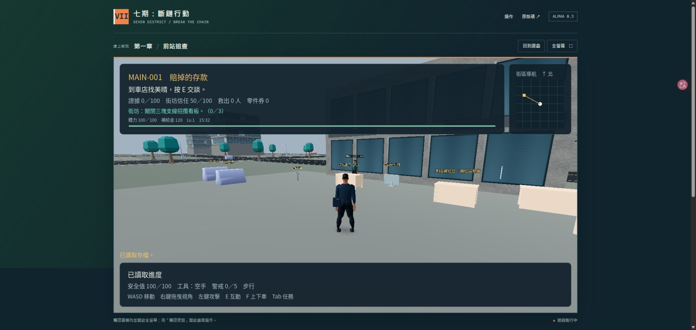

# Alpha 0.3：人物、街景與街區系統

狀態：Alpha 0.3 已發布，可[直接線上遊玩](https://seven-district-reckoning.digimkt.workers.dev)。

## 人物與街景

主角、守衛、行人、美晴、予安、周成換用六個人體比例的骨骼模型。每個模型有 53 根骨骼與八段動作，源自可再散布的 MakeHuman CC0 底模，並保留 Blender 製作檔。這次改善身形與造型區別，表情、手部細節、服裝布料與騎乘貼合仍需後續製作。

城市新增三種商辦、店面、人行道與長椅模型。商辦有逐層幕牆、金屬收邊、入口與屋頂細節；道路加入路口標線、瀝青修補、鋪面、排水溝與導盲紋理。新增道路視覺使用 MultiMesh 合批，沒有新增障礙物，原任務路線保留。

可玩區仍是虛構的 **300 × 300 公尺** Alpha 街區。七期商辦與綠廊是創作參考，沒有匯入真實 GIS 道路、街景照片或掃描模型；這次也沒有擴建成完整台中。

## 體力、挑戰與補給

衝刺消耗體力，停止衝刺後恢復。街區補給金與原有主線分數、支線零件券分開，新遊戲從 120 補給金開始。三項累積挑戰各領一次獎勵：

| 挑戰 | 目標 | 獎勵 |
| --- | --- | --- |
| 用雙腳認路 | 步行 400 公尺 | 90 補給金、80 經驗 |
| 三份交代 | 完成三份不同支線 | 120 補給金、110 經驗 |
| 停用營運設備 | 用工具停用八個不同的合法設備或訓練道具 | 100 補給金、90 經驗 |

搭車、重生位移、重複目標、路人與證據，不會灌進上述挑戰。重玩活動也不算新的支線。挑戰是這份存檔內的累積紀錄，沒有每日重置或線上獎勵伺服器。

四種車店補給包含急救、體能訓練、工具整備與自行車調校；購買需靠近車店，等級不足、補給金不夠、已購買上限或生命已滿時，會保留款項並說明原因。[操作與費用](web-play.md)

## 地圖、日夜與設定

M 開啟大地圖，點選目的地設定導航；角色仍需自行前往。日夜循環以約 20 分鐘遊玩時間走完一天，開啟選單時暫停。

設定包含省電／均衡／細緻畫質、標準／輕鬆難度、視角靈敏度、音效與日夜循環。細緻模式啟用陰影；輕鬆難度降低傷害與追逐壓力。街區進度、升級與設定會隨存檔保留，並接續 Alpha 0.1／0.2 存檔。

網頁操作列新增「地圖」、「補給與挑戰」、「設定」，並顯示體力、補給金、街區階段與時間。沒有原生全螢幕功能的手機瀏覽器可改用頁內放大；手機多點觸控與效能仍需實機驗證。

## 驗收與保留限制

本版合計 1,381 項引擎／玩法／GUI 檢查通過；完整回歸與後續 UI 增量分開記錄。人物另有 192 項 Blender／GLB 檢查，城市模型有 121 項資產檢查，公開資源有 32 項內容與傳輸檢查。Chrome 已實際驗證啟動、舊存檔接續、地圖、補給與日夜介面；手機橫向尺寸的操作也已驗證。[獨立覆核](../qa/v03-integration-review.md) · [瀏覽器驗收](../qa/web-browser-validation-v03.md) · [公開部署檢查](../qa/web-deployment-v03.json)

這仍是單人 Alpha。人物與城市沒有達到寫實大作的美術規模，背景交通採固定路線，地圖導航尚無避障路徑計算，載具採街機控制，完整主線戰役、多人與跨裝置存檔尚未製作。
