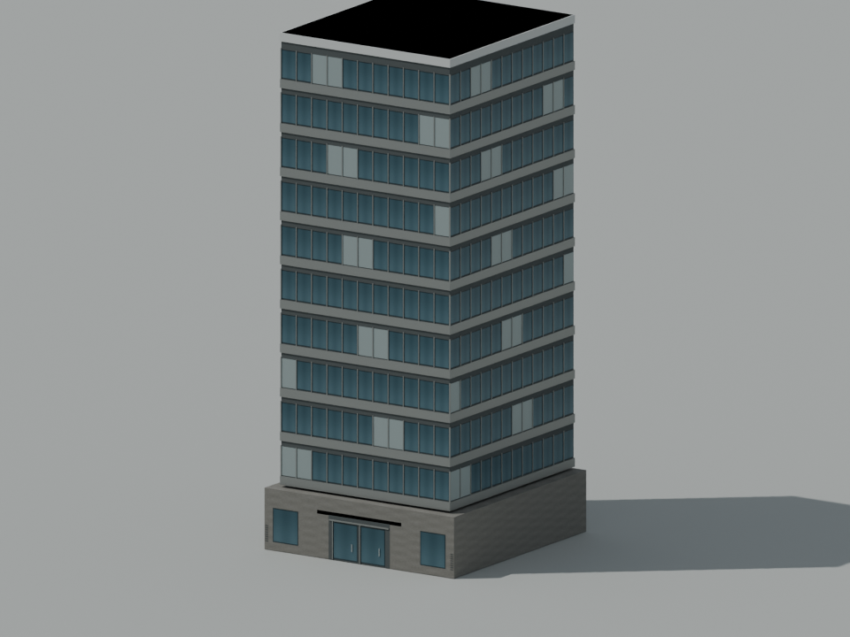
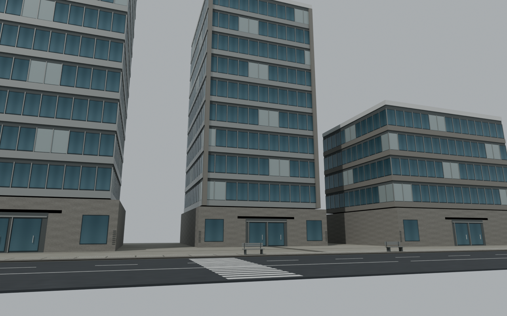

# Urban art lane verification

Status: VERIFIED for asset construction, import, and isolated module contracts.

- Blender 5.2.0 LTS generated six original GLBs, their six editable `.blend` sources, twelve deterministic PBR images, and one editable street review composition.
- `tools/blender/validate_urban_assets.py`: 121 passed, 0 failed. All real GLBs have <20,000 triangles and <=8 materials. PBR images are <=256 px. Complete new runtime source including Godot-extracted images: 6,472,109 bytes across 48 files, under 8 MiB.
- `tests/urban_detail.gd` on real Godot 4.7.2: 46 passed, 0 failed. Twelve crossings, 464 surface instances, 274 kit placements, 15 MultiMesh draw groups, no missing assets, no physics objects or collision shapes, no new obstacle bounds, pause/idempotence contract, correct east-west/north-south road orientation and original 300 m boundary.
- Road matrices scale local unit geometry before yaw. Tests inspect actual CPU-authored matrices submitted to RenderingServer, because Godot's dummy headless renderer reads back identity MultiMesh matrices.
- No changes were made to `main.gd`, `district_life.gd`, player/controller, HUD, deployment, or commits in this lane.

Mapping: `office_tower_a/b/c` to `urban_tower_a/b/c`. The two-floor `urban_shopfront` is 8 m high. It is suitable for low-rise services and stores; keep that height where possible rather than compressing a full tower into 7–11 m. Existing building collision envelopes remain controlled by the root integration.

Nominal authored dimensions: office floor pitch 3.6 m, lobby doors 3.1 m, sidewalk width 3.2 m, bench seat height 0.46 m. These are authored game scale choices. Government primary sources confirm surrounding civic, transit and greenway context; they do not establish these model dimensions as surveyed Taichung measurements. Source links and the original-assets CC0 dedication are in `assets/provenance/v03-urban-sources.json`.

Visual inspection performed on the actual saved previews:

The street review is a Blender asset composition, not a gameplay screenshot. Full root-scene target reachability, WebGL/mobile appearance, and browser frame rate remain integration checks. The assets deliberately use opaque glass to avoid mobile transparency ordering and overdraw; they do not claim photorealistic rendering or a surveyed real-world map.
